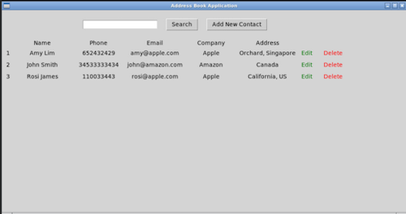

# Address Book Application
  The mini standalone desktop application that have been developed by using **Python programming language**, **Tkinter Python Standard GUI library** and **SQLite database**.The application include basic address book functionalities such as add new person to the address book, update existing person information, delete selected person from the address book, search persons by keywords and viewing sorted list of persons from the address book.

## Table of Contents
  * [Used Technologies](#used-technologies)
  * [Project Structure](#project-structure)
  * [How to run the Application](#how-to-run-the-application)
  * [Features and Implementation](#features-and-implementation)

### Used Technologies
  * Python 3
  * SQLite database
  * Tkinter Python Standard GUI library

### Project Structure
------------

    |-- README.md          <- README file for the detailed development and 
    |                         testing guide of the application.
    |
    |-- main.py            <- Initial starting python file of the application 
    |                         that will open application main window when user 
    |                         run it on terminal.
    |
    |-- ui.py              <- The python module file that have implemented 
    |                         all the user interface logic of the application.
    |
    |-- data.py            <- The python module file that have implemented
    |                         all the data related business logics such as
    |                         adding, deleting, updating, searching, sorting 
    |                         of data list and communicating with SQLite database.
    |
    |-- address_book.db    <- SQLite database file of the application.
    |
    |-- .codio             <- Codio settings file of the application that automatically 
    |                         generated by codio when application create.
    |
    |-- .settings          <- Project settings file of the application.
    |
    |-- .gitignore         <- Gitignore file that has added list of cache files 
    |                         to ignore when commit to github.
    |
    |-- Images             <- Images folder stored screen-shoot images that 
    |                         have been embedded inside the README.md file.
    

### How to Run the Application
  #### 1. Run on Computer
  * Install [Python 3](https://www.python.org/downloads/) in your machine.
  * Install Tkinter **`pip3 install tk`**
  * Download the project zip file from [codio](https://codio.co.uk/mchue/python-lab-1) or from [github](https://github.com/MaChue/Python-Lab-1.git).
  * Path to project directory from the terminal application **`cd your_file_path/Python-Lab-1`**.
  * Type **`python3 main.py`** to run the Python program.

  #### 2. Run on Codio
  ##### a. Run from my codio [Phython Lab 1](https://codio.co.uk/mchue/python-lab-1) workspace.
  * Open Terminal **`Tools > Terminal`** from the codio navigation bar.
  * Type **`python3 main.py`** to run the Python program.
  * Open **`Virtual Desktop`** from the codio navigation bar to see application user interface.

  ##### b. Run from your own codio workspace
  * Go to your codio dashboard.
  * Click on **`My Project`** from the left navigation bar.
  * Click on **`New Project`** button from the top navigation bar.
  * Click on **`Click here`** link under the **`Select your starting Point`** option.
  * Select **`Import > SOURCE > Zip File > browse for files`** and select downloaded **`python-lab-1.zip`** file from your computer.
  * Finally, click **`Create`** button and you will see the project file is open in your codio workspace.
  * Install **`tkinter`** library from terminal **`sudo apt-get install python3-tk`**.
  * Before we run the program, we need to install **`X server`** software to enable Virtual Desktop in the codio environment.
  * Install **`X server`** from **`Tool > Install Software > X server`**.
  * After installation is finished, you will need to restart your codio workspace from **`Project > Restart Box`**.
  * Type **`python3 main.py`** to run the Python program.

  
### Features and Implementation
  ##### 1. Add New Contact
  - Add new person to Person table of **`address_book`** database.
  - Insert new person to existing persons list by using **`binary insertion sort algorithm`**.
  - Show sorted persons list on the main screen with newly added data.

      
      *Figure.1.1. Initial State of Main Screen*
      
      
      *Figure.1.2. Add Contact Screen*

      
      *Figure.1.3. Main Screen After Adding New Person*
  
  ##### 2. Edit Exiting Contact Data
  - Edit selected person data and save edited data back to database.
  - Sort existing person list by using **`insertion sort algorithm`**.
  - Show sorted and updated person list on the main screen

      
      *Figure.2.1. Main Screen*
      
      
      *Figure.2.2. Edit Contact Screen*

      
      *Figure.2.3. Main Screen After Editing Contact*
  
  ##### 3. Delete Selected Contact
  - Delete selected person from the database and existing persons list.

      
      *Figure.3.1. Main Screen Before Deleting*
      
      
      *Figure.3.2. Delete Confirmation Dialog*  

      
      *Figure.3.3. Main Screen After Deleting Contact*  

  ##### 4. Search Contact by Keywords
  - Search person with the keywords that input by the user by using **`linear search algorithm`**.

      
      *Figure.4.1. Main Screen Before Searching*
      
      
      *Figure.4.2. Main Screen After Searching Keyword "rosi"*  

  ##### 5. View Contact list
  - View person list that sorted by name.

      
      *Figure.5.1. Main Screen With Sorted Contact List*
